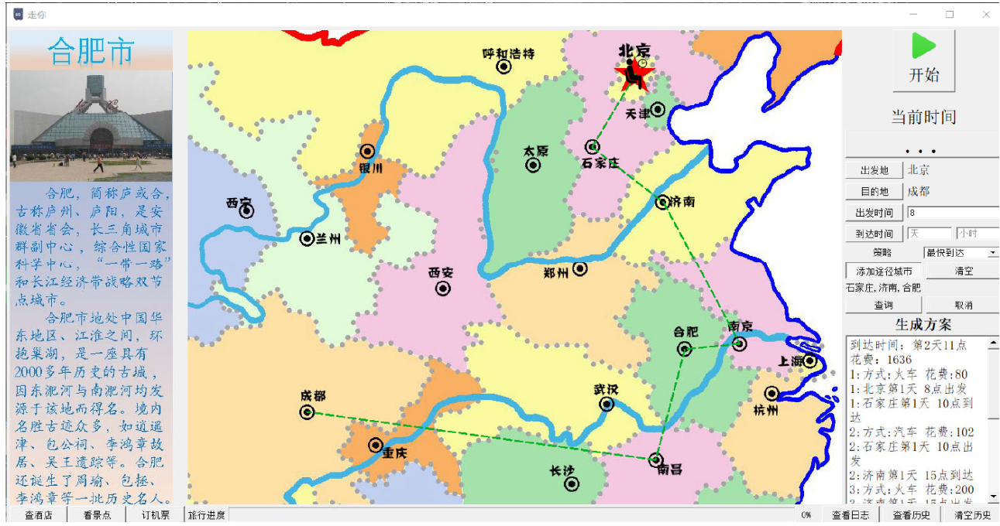

### 项目描述

城市之间有三种交通工具（汽车、火车和飞机）相连，某旅客于某一时刻向系统提出旅行要求，系统
根据该旅客的要求为其设计一条旅行线路并输出。

旅行要求有：

+ 最少费用策略：无时间限制，费用最少即可
+ 最少时间策略：无费用限制，时间最少即可
+ 限时最少费用策略：在规定时间内所需费用最省

### 项目结构

+ MainWindow：主窗口，用户的交互界面，承担输入输出和调用其他模块的功能。展示各个城市，
  提供各个城市相应的服务。
+ Polity：策略模块，用于接收输入的旅行计划并计算生成旅行方案。
+  PaintMap：将计算得到的旅行计划路线在地图上画出来，并在开始模拟之后模拟时间的推进。
+ Log：日志模块，提供多种接口，方便其它模块快速输出日志。
+ LogDisplay：查看日志模块，显示当前的日志。
+ HistoryDisplay：历史记录模块，打开程序的时候载入历史记录文件，添加历史记录，显示历史
  记录，在用户选择某历史记录后返回该历史记录。
+ WorkThread：工作线程模块，计算策略在该类中进行，以免计算时间过长用户界面不响应。

### 项目截图

+ 最左边有每个城市的介绍，当鼠标在中间地图点击时可以显示该城市的介绍。
+ 中间的地图，点击相应城市，可以输入该城市到旅行计划中，同时旅行模拟的时候，可以在地图上画出线路，实时行进。
+ 右边是控制面板和信息面板。

### 项目亮点

在限定时间内花费最小，这个问题是一个NP问题。我们没有选择常规的模拟退火，遗传等解决NP问题的传统算法，而是通过研究搜索的过程，不断的剪枝，不断的加快搜索速度，最终在该问题上，可以快速搜索出全局最优的方案，而不是局部最优。

### 个人贡献

贡献了超过80%的代码。